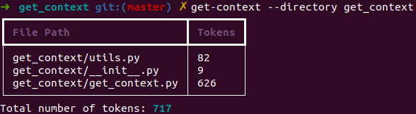

# get_context

`get_context` is a Python command-line tool that extracts context information from Python files and copies it to the clipboard. The extracted information includes the file's purpose, its classes, functions, and methods. This can be helpful when you need to provide context to chatgpt when asking it to write code for you

## Installation

To install the `get_context` tool, clone the repository and run the setup script:

```bash
git clone https://github.com/yourusername/get_context.git
cd get_context
python setup.py install
```

## Example Usage

